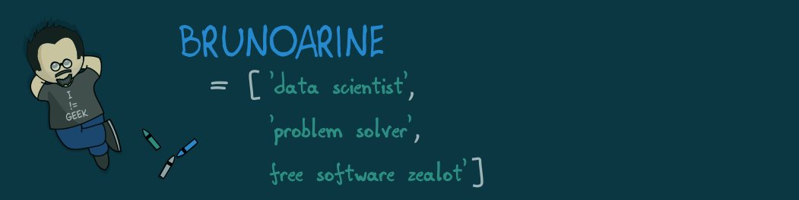

### Hi, I'm Bruno 👋

I’m a problem solver, and I want to get serious about solving back-end and mobile development problems! I have 10 years of experience as Physicist (Radiometry Specialist), and during this time I have used Python extensively to test and develop analysis algorithms, and implement UX tools to help the laboratory team with their routine tasks. In my masters thesis, I used machine learning (SciPy and Scikit-learn) to improve peak detection rates of gamma-ray spectrometry systems. Now I want to expand my horizons.

- 🔭 I'm currently working on my Software Engineering certificate.
- 🌱 I’m currently learning Kotlin.
- 👯 I’m looking to collaborate on development projects where I can solve problems and optimize solutions.
- 😄 Pronouns: he/him
- ⚡ Fun fact: I draw a webcomic called [Nebulosa Bar](https://www.nebulosabar.com.br). Also, I like to photograph things, and lift heavy things.
- 📫 You can find out more about me on:
  - [My website](https://brunoarine.com)
  - [My public notes](https://notes.brunoarine.com)
  - [Linkedin](https://www.linkedin.com/in/bruno-arine)
  - [Twitter](https://twitter.com/brunoarine)
  - [Goodreads](https://www.goodreads.com/brunoarine)
  - [Instagram](https://instagram.com/brunoarine)
